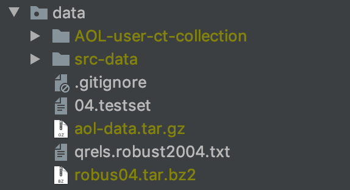

# weak_supervision_ltr
my implementation of [Neural Ranking Models with Weak Supervision](https://arxiv.org/pdf/1704.08803.pdf) on Robust04.

## Environment
- Python3.7
- MongoDB
- ElasticSearch 6.x


## Experiment Result on Robust04
| Model | MAP@1000 | P@20 | NDCG@20 |
| :------| ------: | ------: |
| BM25 | 0.2557 | 0.3357 |0.4175|
| Bert-Base default | 0.26139 | 0.3551 | 0.434792|

## Implementation Detail
### 1. Data Preprocess
insert data into mongodb
#### 1.1 Extract Robus04
Download [Robus04](https://drive.google.com/file/d/1qC-XaEgbdlUJOjsOxU2YcKabBsFFCAxO/view?usp=sharing) and put under `data` folder.

```sh
cd data
tar -jxvf robus04.tar.bz2
```

#### 1.2 Parse Document
Insert documents into MongoDB.
```
cd data_preprocess
python import_doc_with_xml.py
```

Parse documents.
```
cd data_preprocess
python parse_doc_xml.py
```

Tokenize documents.
```
cd data_preprocess
python tokenize_docs.py
```

Extract Doc Ids.
```
python export_docIds.py
```

#### 1.3 Parse Query
Parse Query and insert into MongoDB
```
cd data_preprocess
python parse_query.py
```

#### 1.4 Parse Labels
Parse Rank Lbales and save under `data` folder
```
cd data_preprocess
python parse_rank_labels.py
```

#### 1.5 Extract AOL Query Set
Download [AOL_Query_Set](https://drive.google.com/file/d/1UDjznZ0D49bZN4gJvUHVBr-QQDFl-2BO/view?usp=sharing) and put under `data` folder.
```sh
cd data
tar zxvf aol-data.tar.gz
```

After extraction, enter `AOL-user-ct-collection`, and unzip all of the `txt.gz`
```sh
cd AOL-user-ct-collection
gunzip -d *.gz
```

#### 1.6 Parse AOL Queries
Insert AOL Queries into MongoDB.
```sh
cd data_preprocess
python parse_AOL_query.py
```

Shuffle AOL Queries.
```sh
python shuffle_aol_queries.py
```

Filter AOL Queries.
```sh
python filter_aol_query.py
```

Tokenize AOL Queries.
```
python tokenize_aol_queries.py
```

### 2.Pairwise Data Creation

#### 2.1 Create ElasticSearch Index
Start Elasticsearch First, And create Index For the following Weak Supervision.
```
cd data_preprocess
python create_index_in_elasticsearch.py
```

#### 2.2 Create Pairwise Data
Insert Pairwise Data into MongoDB.
```
cd data_preprocess
python create_pairwise_data_top10.py
```

Dump to filesystem.
```
python extract_pairwise_data.py

```

#### 2.3 Get ReRank List when Training Evaluation
```
cd data_preprocess
get_list_to_re-rank.py
```


### 3.Training
```
cd code-bert
python train_bert.py
```

The Default metrics is MAP@100. For more metrics, you can check `metrics.py`.